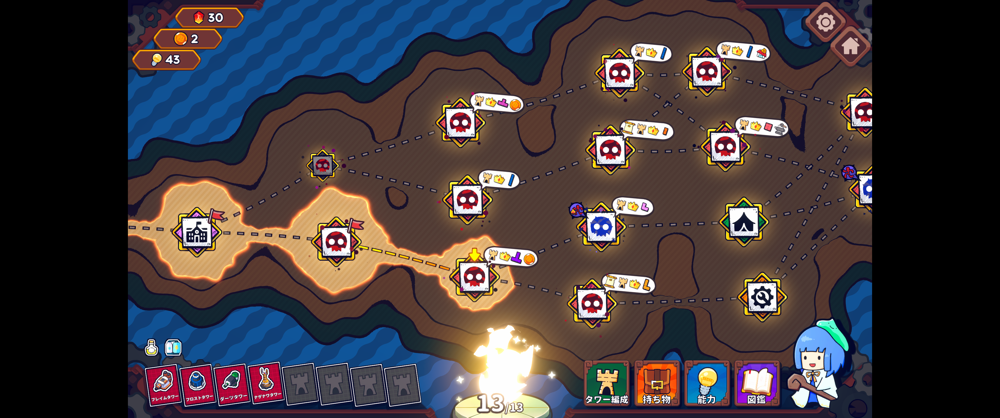

## はじめに

Slay the Spireにハマったあと、同じようなデッキ構築系ローグライクを探していました。

その中で見つけたのが**Emberward**。テトリスのようなブロックで敵の通り道を作る見た目が面白そうで始め、気付けば10時間ほど遊んでいました。

攻略を書くにはまだ早いので、今回は「どんなゲームだったか」「どこが面白かったか」を残しておく備忘録です。

> 早期アクセス版を遊んだ時点の内容です。今後のアップデートで変わる可能性があります。

## Emberwardはどんなゲーム？

ざっくり言うと、**テトリスのようなブロックで迷路を作る、ローグライトのタワーディフェンス**です。

ブロックで敵の道を伸ばし、その周りにタワーを配置して「生命の炎」を守ります。タワーの火力だけでなく、敵をどこへ歩かせるかも重要です。

Steamで遊べるPCゲームで、日本語インターフェースにも対応しています。

ジャンルは公式表記に合わせて、この記事では**ローグライト**としています。ランが終わるとその回の構成はリセットされますが、タレントやアンロック要素は次回にも残ります。

## 1ランの流れ

「ラン」は、スタートからボス撃破か敗北までの1回の挑戦です。

1. キャラクターと炎、最初のタワーなどを選ぶ
2. 分岐マップから、戦闘・ショップ・キャンプサイトなどの行き先を選ぶ
3. ブロックで迷路を作り、タワーを置いてウェーブを迎え撃つ
4. 報酬のタワー・ブロック・レリックを選び、構成を整える
5. これを繰り返してボスを目指す

*戦闘やショップなどから、次の行き先を選んで進みます。*

Slay the Spireを遊んでいれば、マップを進みながらその場の報酬で構成を作る流れは分かりやすいと思います。

## 10時間ほど遊んだメモ

### 迷路作りが思った以上に面白い

手元のブロックは形が決まっているので、好きな場所へ自由に壁を引けるわけではありません。

敵の道を長くしたい一方で、タワーを置く場所も残したい。このバランスを考えるのが面白いところでした。

同じタワーでも置く場所や迷路の形で働き方が変わるため、毎回同じ配置になりにくいです。

### 初めてでも入りやすそう

チュートリアルやゲーム内の説明はかなり丁寧です。

ブロックの置き方、タワーの配置、ウェーブの進め方を順番に覚えられるので、ローグライトやタワーディフェンスが初めてでも取っつきやすそうでした。

基本は分かりやすいですが、強い迷路や組み合わせを考える余地はしっかり残っています。

### まだかなり遊べそう

タワーだけでなく、ルーン、レリック、キャラクター、炎にも組み合わせがあります。

約10時間の時点では、まだ試せていない構成が多め。「次は別の組み合わせで」と考えてしまうので、かなりやり込めそうな感触です。

後半はマップごとのギミックもあり、ステージに合わせて迷路や配置を考え直す場面もあります。タワーやレリックの組み合わせも含め、毎回のランが同じ展開になりにくそうなのも好印象でした。

## 海外コミュニティで見かけた意見

SteamやRedditも少し見てみました。Steamでは、2026年7月29日時点で全言語レビューが「圧倒的に好評」です。

良い点としてよく見かけたのは、次のような内容でした。

- ブロックで迷路を作る仕組みに独自性がある
- タワーやレリックの選択肢が多く、繰り返し遊びやすい
- 組み合わせを見つける楽しさがある

一方で、気になる点として挙がっていたのはこちら。

- じっくり考えると1ランが長くなりやすい
- タワーや属性の強さに差を感じることがある
- 負けた原因が分かりにくい場面がある
- 発展的な日本語攻略はまだ少ない

自分は今のところ、プレイ時間の長さよりも「もう1回試したい」が勝っています。

基本操作はゲーム内で十分分かりますが、強い構成や高難度の攻略を調べるなら、海外コミュニティも参考になりそうです。

## まとめ

Emberwardは、ローグライトの進行と、テトリスのようなブロックを使った迷路作りを組み合わせたタワーディフェンスです。

入り口は分かりやすいのに、遊ぶほど考えることが増えていくのが好印象でした。10時間ではまだ触り切れていないので、もう少し遊びながら迷路やタワーの使い方も記録していきます。

## 参考リンク

- [Emberward — Steamストアページ](https://store.steampowered.com/app/2459550/Emberward/?l=japanese)
- [Emberward — Steamニュース](https://steamcommunity.com/app/2459550/allnews/)
- [Reddit：ローグライトTDの比較で挙がった意見](https://www.reddit.com/r/roguelites/comments/1propz0/which_one_for_the_best_tower_defense_roguelite/)
- [Reddit：選択の深さやリプレイ性についての投稿](https://www.reddit.com/r/emberward/comments/1euyrim/game_is_underrated/)
- [Reddit：初心者向け攻略情報を探す投稿](https://www.reddit.com/r/emberward/comments/1f0lucz/can_you_recommend_a_guide_or_give_tipsadvice/)
- [Slay the Spire — Steamストアページ](https://store.steampowered.com/app/646570/Slay_the_Spire/)
