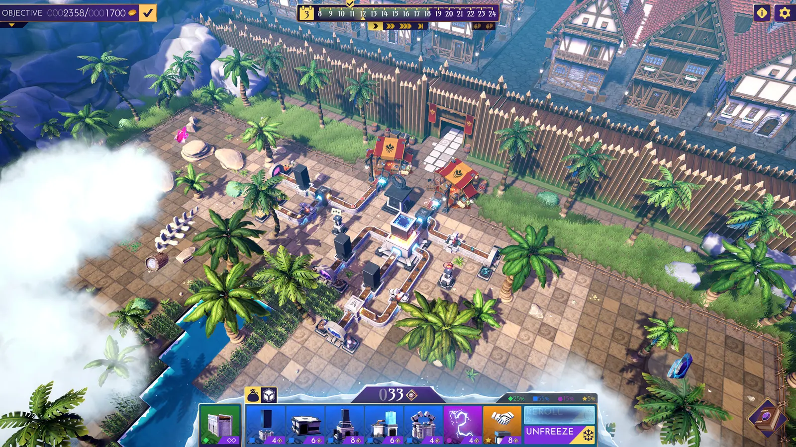
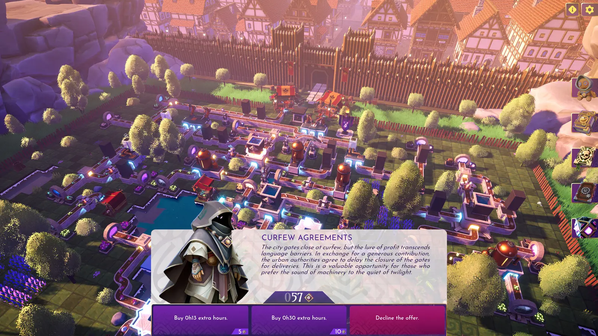
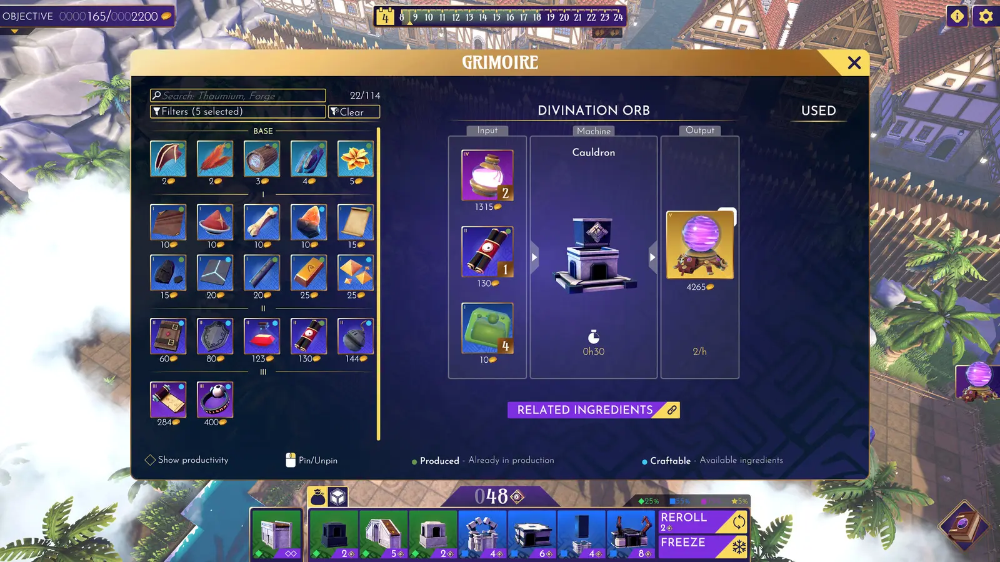
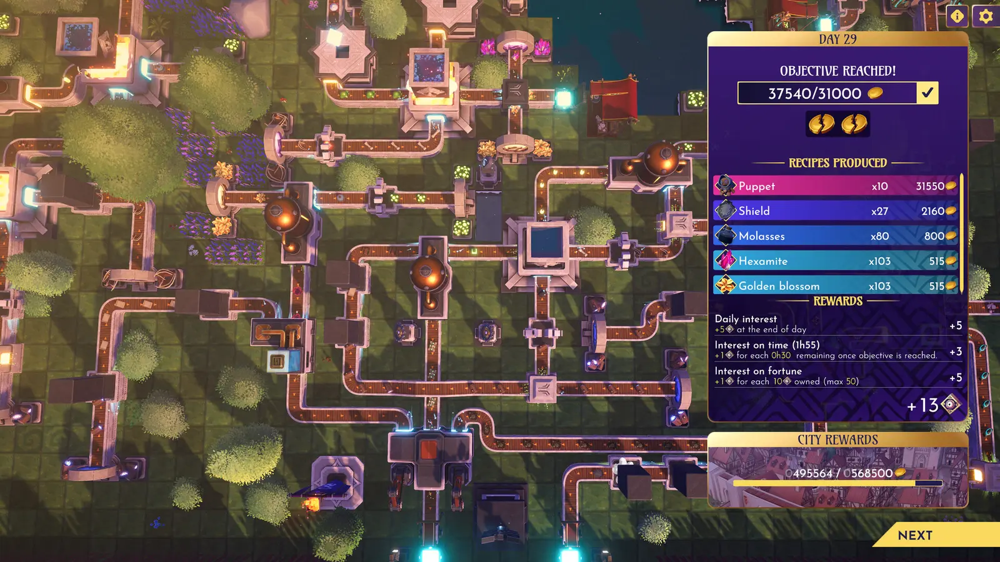

Steamで次に遊ぶゲームとして、工場建設×ローグライトの『Factomancer』が気になっている。

魔法で機械を動かして生産ラインを作りながら、ランごとに変化するマップやイベントへ対応していくゲームらしい。

まだ実際には遊んでいないため、今回は感想ではなく、公式Steamページと開発元の公式動画で公開されている内容だけを整理する。プレイ後には、工場建設とローグライトがどのように組み合わさっているのかも改めてまとめたい。

> ※本記事は2026年8月4日時点の公式情報をもとにしています。開発中のため、正式版では内容が変更される可能性があります。

## 『Factomancer』とは

『Factomancer』は、フランス・リヨンのインディースタジオVoltige Gamesが開発する自動化ローグライト。

舞台は、魔法が「秩序」と呼ばれる組織のテクノロジーを動かしている世界・カルノール。プレイヤーは魔法資源を物資やアーティファクトへ加工し、生産ラインを設計・自動化しながら、「秩序」から与えられた目標の達成を目指す。

| 項目 | 内容 |
|---|---|
| 開発・販売 | Voltige Games |
| ジャンル | 工場建設・自動化・ローグライト |
| プレイ人数 | シングルプレイ |
| 対応OS | Windows / macOS |
| 日本語 | インターフェース・字幕に対応 |
| 正式版の発売予定 | 2026年第4四半期 |
| 体験版 | Steamで無料配信中 |

*公式スクリーンショット。画像出典：[Factomancer Steamストア](https://store.steampowered.com/app/3979570/Factomancer/?l=japanese)／© Voltige Games*

## 工場建設にローグライトを組み合わせる

基本は、資源を加工する機械を設置し、生産ラインをつないで工場を拡張していく工場建設ゲーム。

そこへ、プレイごとに変わるマップや突発的なイベント、時間の限られた日ごとの目標が加わっている。新しい機械を買うか、土地を広げるか、レリックや呪文を入手するかを選び、そのランの状況に合わせて工場を組み直していく。

公式は本作について、『Factorio』『Satisfactory』の工場建設と、『Slay the Spire』の臨機応変な対応や戦略的な選択を組み合わせたゲームと説明している。『Against the Storm』のファンにもなじみやすいとしており、一つの工場を延々と拡張するタイプとは少し違う設計になりそうだ。

*ラン中には判断を求めるイベントも発生する。画像出典：[Factomancer Steamストア](https://store.steampowered.com/app/3979570/Factomancer/?l=japanese)／© Voltige Games*

## 呪文とレリックで生産を変える

本作では、魔法は世界観だけでなく工場を強化する仕組みにも使われる。

「秩序」から与えられる呪文やレリックを利用し、生産能力を高めたり、土地や機械へ影響を与えたりできる。体験版には15種類以上の機械、7種類の呪文、25種類のレリックが用意されており、組み合わせによる相乗効果も試せると案内されている。

*レシピや関連素材を確認できるグリモワール。画像出典：[Factomancer Steamストア](https://store.steampowered.com/app/3979570/Factomancer/?l=japanese)／© Voltige Games*

## 無料体験版は30日間のランを収録

Steamで無料配信されている体験版には、主に次の内容が収録されている。

- 魔法の案内役「PROF-IT」によるチュートリアル
- 30日間のクラシックラン
- 正式版に登場する5つのうち、2つのバイオームと勢力
- プレイごとに新しく生成されるマップ
- 選択可能な難易度
- 15種類以上の機械、7種類の呪文、25種類のレリック

当初は時間を止められない設計だったが、2026年7月3日の体験版アップデートでポーズ機能が追加された。日ごとの目標や時間管理は残っているものの、現在はゲームを一時停止し、落ち着いて建設や配置を考えられる。

*日ごとの目標と生産結果を確認する画面。画像出典：[Factomancer Steamストア](https://store.steampowered.com/app/3979570/Factomancer/?l=japanese)／© Voltige Games*

## 公式デモトレーラー

開発元のVoltige Gamesが公開しているデモ版の公式トレーラーでは、生産ラインの構築、呪文、イベントなどを確認できる。

  <iframe src="https://www.youtube-nocookie.com/embed/65YGs0VhCJs" title="FACTOMANCER - Demo Launch Trailer" loading="lazy" allow="accelerometer; autoplay; clipboard-write; encrypted-media; gyroscope; picture-in-picture; web-share" allowfullscreen style="position: absolute; inset: 0; width: 100%; height: 100%; border: 0;"></iframe>

動画：[FACTOMANCER - Demo Launch Trailer](https://www.youtube.com/watch?v=65YGs0VhCJs)／Voltige Games公式YouTubeチャンネル

## 日本語対応で、今すぐ無料で試せる

Steamの表記では、日本語のインターフェースと字幕に対応している。体験版も日本語対応として配信されているため、ゲームの仕組みや効果を日本語で確認できる。

正式版は2026年第4四半期に発売予定。現時点では無料体験版をダウンロードでき、製品版のSteamページではウィッシュリストへの追加も可能となっている。

- [『Factomancer』製品版の公式Steamページ](https://store.steampowered.com/app/3979570/Factomancer/?l=japanese)
- [『Factomancer Demo』をSteamで見る](https://store.steampowered.com/app/4678410/Factomancer_Demo/?l=japanese)

## まとめ

公式情報を見る限り、『Factomancer』は工場の効率だけを追い続けるのではなく、30日間という区切りやランダムイベント、呪文・レリックによって、その場で工場の方針を変えていく作品になっている。

工場建設とローグライトが実際にどこまで自然につながっているのかは、これから体験版を遊んで確認したい。次の記事では、チュートリアルと1ランを遊んだ時点の感想をまとめる予定。

## 参照した公式情報

- [Factomancer Steamストア](https://store.steampowered.com/app/3979570/Factomancer/?l=japanese)
- [Factomancer Demo Steamストア](https://store.steampowered.com/app/4678410/Factomancer_Demo/?l=japanese)
- [Demo Update: In-Game Pause（Steam News）](https://steamcommunity.com/app/3979570/allnews/)
- [Voltige Games公式YouTubeチャンネル](https://www.youtube.com/@VoltigeGames)
