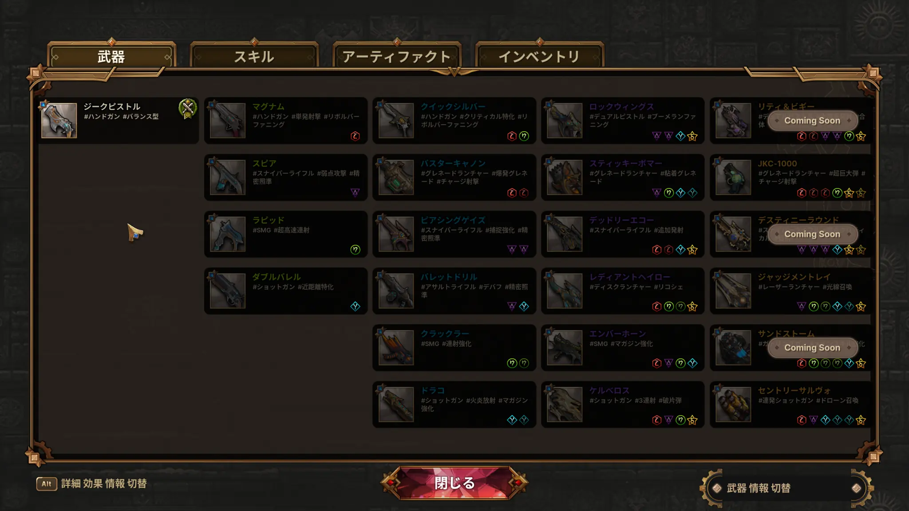

『Guns & Dragons』を遊び始めて、最初に分かりにくかったのが武器の作り方です。

基本的な流れは、次のようになっています。

> **ルーンを集める → 条件を満たした武器が候補に出る → 欲しい武器を選ぶ**

武器を選ぶと、必要なルーンは作成に使われ、未使用ルーンとしては残りません。序盤の武器をすぐ作るか、ルーンを温存して上位武器を狙うかが重要です。

この記事では、初回Steamプレイテストで確認できた武器作成の仕組みと、初心者が迷いやすい点をまとめます。

> ※2026年8月4日時点のプレイテスト情報です。正式版では名称・数値・作成条件などが変わる可能性があります。

ゲーム全体の感想は、[『Guns & Dragons』プレイテスト感想](/blog/guns-and-dragons-playtest-impressions/)で紹介しています。

## 武器はルーンの組み合わせで作る

武器一覧には、各武器を作るために必要なルーンが色付きアイコンで表示されています。

初期キャラクター「ジーク」の場合は、左端の「ジークピストル」が起点です。気になる武器を見つけたら、武器の右下にある色と個数を確認します。

プレイ中に確認できた序盤のレシピは、次のとおりです。

| 武器 | 必要なルーン |
|---|---|
| マグナム | 赤×1 |
| スピア | 紫×1 |
| ラピッド | 緑×1 |
| ダブルバレル | 水色×1 |
| クイックシルバー | 赤×1＋緑×1 |
| バスターキャノン | 赤×2 |
| ピアシングゲイズ | 紫×2 |
| クラッカー | 緑×2 |
| ドラゴ | 水色×2 |

武器名の色が緑ならルーン1個、青なら2個、紫なら4個、オレンジなら6個が必要です。正式なレア度名は未確認ですが、右側の武器ほど完成までに多くのルーンを使います。

「Coming Soon」と表示された武器は、レシピが見えていても現在のプレイテストでは作れないようです。

## 武器を作る手順

### 1．目当ての武器を決める

武器一覧を開き、作りたい武器のルーンを確認します。最初からすべてのレシピを覚える必要はなく、一つだけ仮の目標を決めれば十分です。

### 2．必要な色のルーンを集める

ラン中の選択では、効果だけでなくルーンの色も確認します。毎回ばらばらな色を取ると、目当てのレシピを完成させにくくなります。

### 3．候補から武器を選ぶ

必要なルーンがそろうと、作成可能な武器が候補に出ます。自動で武器が変わるのではなく、その中から欲しい武器を選ぶ仕組みです。

### 4．必要なルーンは作成に使われる

武器を選ぶと、レシピに必要なルーンは作成に使われ、未使用ルーンとしては残りません。

たとえばルーン1個の武器を序盤に作ると、その色を材料にする紫やオレンジの武器は、同じ色を再び集めるまで完成が遠のきます。作成可能になっても、すぐ選ぶ必要はありません。

## すぐ作るか、ルーンを温存するか

| 選択 | メリット | 注意点 |
|---|---|---|
| 序盤の武器を作る | その場の戦闘が楽になりやすい | 上位武器に必要なルーンを使う |
| ルーンを温存する | 紫・オレンジの武器を狙いやすい | 完成まで現在の武器で戦う必要がある |

ジークの初期武器「ジークピストル」は優秀で、実際に武器を交換しなくても第1ステージをほぼ進められました。そのため、目当ての武器があるならルーンを温存しやすいです。

一方、敵を倒すのに時間がかかる場合や、欲しい色がなかなか出ない場合は、緑や青の武器を早めに作るのも選択肢です。

どこまで初期武器で我慢するかは、そのランの引きとプレイスタイル次第だと感じました。

## 武器を入手したら効果も確認する

武器にはコアや固有効果が付き、同じ武器種でも性能が変わります。

また、右クリックが照準ではなく、固有射撃やモード切り替えになっている武器もあります。「ラピッド」では、右クリック長押しで命中精度と引き換えに攻撃速度を上げる機能を確認できました。

新しい武器を入手したら、説明と左右クリックの動作を一度確認しておくとよさそうです。

## 初心者が迷いやすい点

### 作れる武器をすぐ選んでしまう

一度作成に使ったルーンは、未使用ルーンとしては残りません。上位武器を狙うなら、序盤の候補を見送る判断も必要です。

### 特性の色とルーンの色を混同する

特性選択の色はレア度、武器一覧の色付きアイコンはレシピに必要なルーンです。同じ特性でも高レアほど効果が強化されるようですが、武器作成とは別の仕組みです。

## まとめ

『Guns & Dragons』の武器は、必要なルーンをそろえ、表示された候補から選んで作成します。

必要なルーンは作成に使われるため、序盤の武器を取るほど上位武器の完成は遅くなります。ジークピストルで戦える間は、先に武器一覧で目当てを決めてルーンを温存するのが分かりやすい進め方です。

ただし、その場の安定を取るか、上位武器まで待つかに正解はありません。この判断も武器ビルドの面白さになりそうです。

## 参考情報

- [Steam：Guns & Dragons](https://store.steampowered.com/app/4687860/Guns_and_Dragons/)
- [ABUTTON公式：Guns & Dragons](https://www.abutton.com/games)
