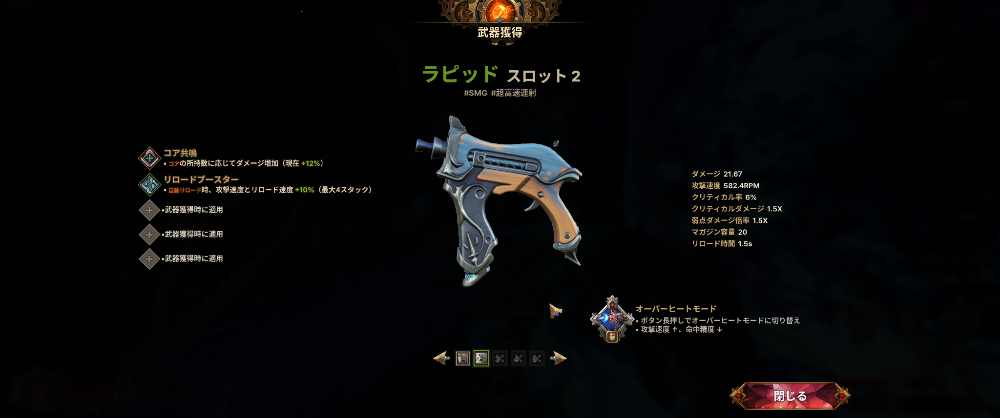
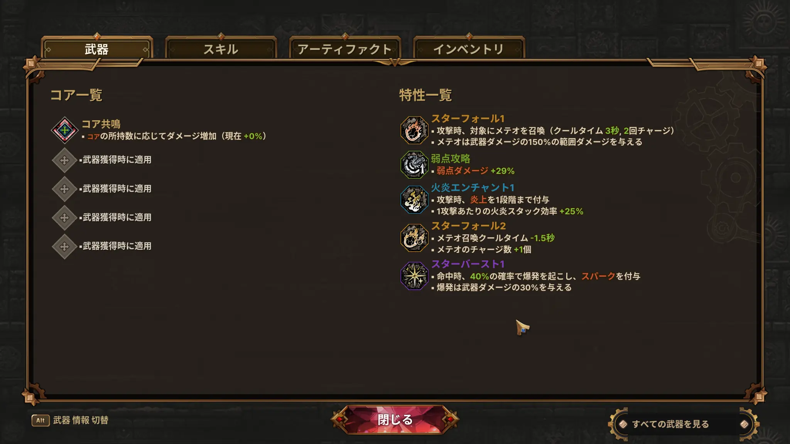
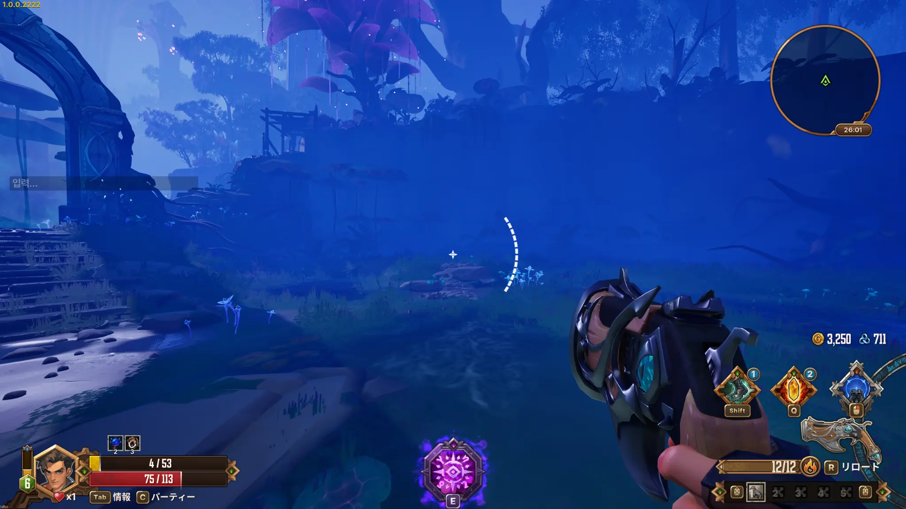

> ※本記事は、2026年7月30日から8月10日まで実施されている初回Steamプレイテスト版を約1時間遊んだ時点の感想に、その後の追加プレイで分かった内容を追記しています。開発中のため、正式版では内容が変更される可能性があります。

Steamで始まった『Guns & Dragons』のプレイテストを遊んでみました。

銃や弓を使ってダンジョンを進むローグライトFPSです。『Gunfire Reborn』と『Roboquest』はどちらも最終難易度までやり込んでいるため、同じジャンルの新作として気になっていました。

実際に触った印象は『Gunfire Reborn』寄り。一方で、土台や壁、屋根を自由に配置できる拠点建築があり、ここが本作ならではの要素になりそうです。

## 『Guns & Dragons』とは

『Guns & Dragons』は、韓国のABUTTONが開発しているローグライトFPSです。

舞台は、魔法と機械技術が混ざった「マジテック」風のファンタジー世界。銃や弓を使ってモンスターと戦い、ルーン、遺物、スキルなどを組み合わせながら、そのラン限りのビルドを作っていきます。

主な特徴は次のとおりです。

- ソロまたは最大3人でのオンライン協力プレイ
- 45種類以上の銃、弓、クロスボウ
- 武器、アイテム、スキルを組み合わせるビルド構築
- キャラクターごとに異なる固有スキル
- 持ち帰った素材による永久強化
- 土台、壁、屋根などを組み合わせる拠点建築

開発チームには『Counter-Strike Online』や『Blade & Soul 2』などに携わったメンバーが参加しています。

クイックマッチも用意されているようで、最大3人の協力プレイにも気軽に参加できそうです。今回は実際のマッチングまでは試していないため、待ち時間やプレイ中の安定性は未確認です。

## 操作感もGunfire Rebornにかなり近い

射撃や移動の手触りを含め、全体的な操作感は『Gunfire Reborn』とほぼ同じ印象でした。遊び慣れていることもあり、すぐに操作へなじめました。

最初のランは約20分で、全3ステージのうち第1ステージのボスに敗北しました。その後のランでは第1ステージをクリア。道中で武器やアイテムを入手し、レベルアップなどでスキルを選びながら、そのランで使うビルドを組んでいきます。

ランダムに提示された選択肢から強化方針を考える流れは分かりやすく、『Gunfire Reborn』を遊んだことがあれば、基本的な仕組みはすぐにつかめると思います。

## 武器ごとに特徴がありそう

武器は、単純に威力や連射速度が違うだけではなさそうです。今回使ったピストルの中には、エイム中に自動で敵の弱点を狙ってくれるものがあり、持ち替えたときにプレイ感も変わりました。

公式情報では45種類以上の銃や弓が登場するとされています。ほかの武器にも固有の仕組みがあり、アイテムやスキルとの組み合わせによって毎回違ったビルドを楽しめそうです。

武器獲得画面では、基礎性能だけでなく固有効果も確認できます。今回入手した武器には、リロード時に攻撃速度とリロード速度が上昇する効果や、射撃方式を切り替えるオーバーヒートモードが付いていました。

## キャラクターごとにスキルが異なる

キャラクターごとに固有スキルがあり、同じ武器でもビルドの方向性が変わりそうです。短時間ではすべて試せていませんが、キャラクター、武器、ラン中のスキルをどう組み合わせるかが本作の中心になりそうです。

## スターフォール特化で、メテオが主役のビルドに

第1ステージをクリアしたランでは、「スターフォール1」と「スターフォール2」を取得しました。

スターフォール1は、攻撃時に対象へメテオを召喚し、武器ダメージの150％に相当する範囲ダメージを与える特性です。さらにスターフォール2によって、メテオの召喚クールタイムが1.5秒短縮され、チャージ数も1つ増えました。

効果が重なった後はメテオが主なダメージ源となり、ほぼスターフォールだけで戦っているような感覚でした。こうして一つの特性へ極端に寄せた、とがったビルドが成立するのは、本作のローグライトとしての醍醐味だと感じます。

## 第1ステージクリア後に操作不能になる現象も発生

一方、第1ステージをクリアした直後に、移動や射撃などが反応しなくなる現象が一度発生しました。メニューだけは操作できたため、今回はそのまま拠点へ帰還しました。

画面左側には韓国語で「入力…」と表示されており、チャット入力に操作が奪われていた可能性もあります。ただし原因は特定できていません。プレイテスト版で一度発生した現象として記録しておきます。

## 日本語翻訳はほとんど違和感なし

Steamストアでは日本語非対応と表示されていましたが、実際のプレイテスト版は日本語で遊べました。

タイトルやメニューだけでなく、キャラクターのセリフ、武器、アイテム、スキルの説明まで日本語になっています。

今回遊んだ範囲では、通常のメニューや効果説明の日本語はほとんど自然でした。ビルドを考えるゲームでは効果説明の読みやすさが重要なので、日本語で内容を理解しやすいのは安心できる点です。

ただし、前述の操作不能時には画面左側に韓国語の入力表示が残っていました。通常プレイ中の翻訳品質には大きな問題を感じませんでしたが、プレイテスト版では一部に原文が残る可能性があります。

ストア表記と実際のプレイテスト版で対応状況が異なるため、正式版での日本語対応については今後の案内を確認したいところです。

## 自由に組み立てられる拠点建築

『Guns & Dragons』で特に珍しく感じたのが、拠点を自分で建築できることです。よくある永久強化に加えて、土台、壁、屋根などを組み合わせ、拠点の形を自由に作れます。

一方、序盤では、建てた拠点が戦闘や次のランにどう影響するのかがまだ分かりにくく、ローグライト部分とのかみ合いは薄く感じました。

建築自体は面白そうなので、ゲームを進めることで施設や永久強化とのつながりが増えていくのか、今後に期待したい部分です。

## 追加プレイ後の感想

全体的な評価は引き続きかなり高めで、同じジャンルの新作として今後にかなり期待できる内容でした。

スターフォールへ寄せたランでは、特性を重ねることでメテオが主力になるほど、とがったビルドが成立しました。毎回の選択次第で戦い方が大きく変わる面白さを、具体的に確認できたのは良かった点です。

一方で、第1ステージクリア後に一度操作不能になる現象も発生しました。拠点建築とローグライト部分の結び付きもまだ見えにくく、プレイテスト版らしい不安定さや未確認の要素は残っています。

第2ステージ以降はまだ未確認なので、もう少し遊びながら、別のキャラクターや武器でどのようなビルドが成立するのかも確認したいと思います。

初回Steamプレイテストは2026年8月10日まで実施予定です。参加する場合は、Steamストアページからアクセスをリクエストできます。

## 参考情報

- [Guns & Dragons Steamストアページ](https://store.steampowered.com/app/4687860/Guns_and_Dragons/?l=japanese)
- [ABUTTON公式ゲーム紹介](https://www.abutton.com/games)
- [GamesBeatによる発表記事](https://gamesbeat.com/abutton-reveals-guns-dragons-gameplay-in-new-trailer-and-announces-playtest/)
- [Roguelikerによる紹介記事](https://rogueliker.com/dave-the-diver-guns-and-dragons/)
