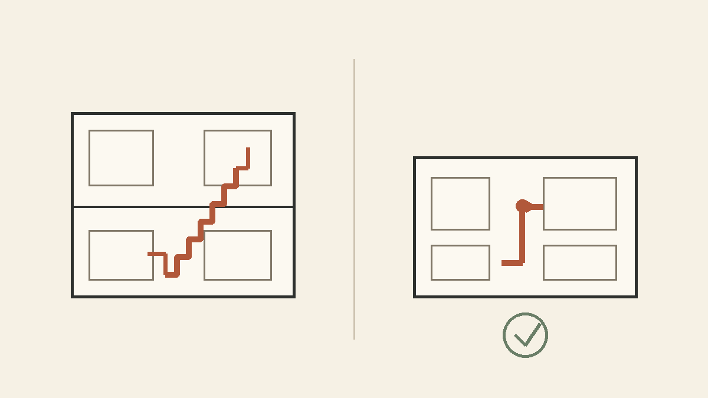
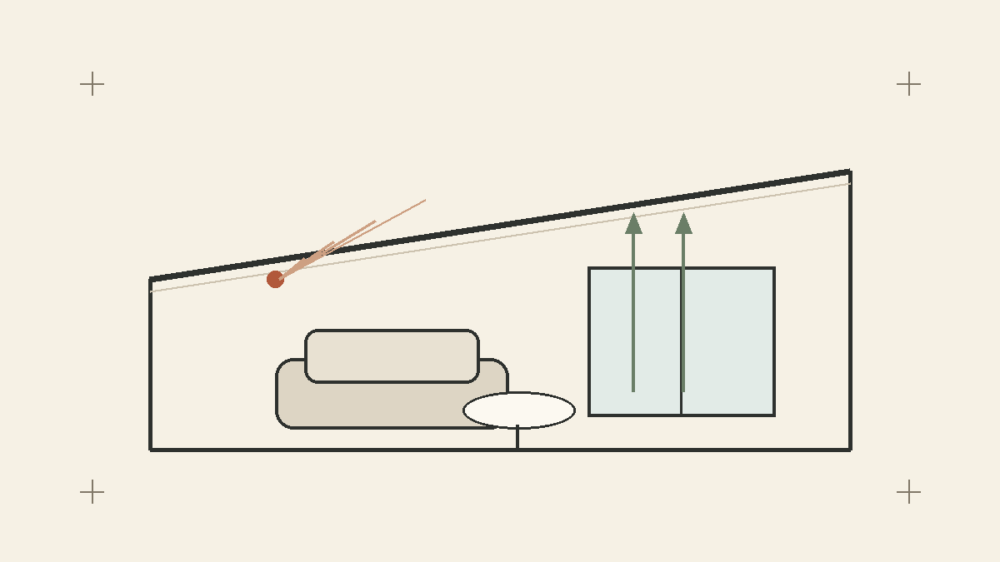

一条工務店のグランスマートで、約28坪の平屋を建築中である。

せっかくなので、なぜこのくらいの広さにしたのかを今のうちに残しておく。

打ち合わせ中はいろいろ考えて決めているはずなのに、数年後にはたぶん結構忘れている気がするので。

結論からいうと、わが家では「家を大きくするより、無駄なスペースをなるべく減らして、よく使うところにお金をかける」という考え方に落ち着いた。

その結果が、約28坪の平屋＋リビングの勾配天井である。

ちなみに、この記事を書いている時点ではまだ建築中。なので「実際に住んでみたら全然違った」という可能性も普通にある。そのあたりは入居後に答え合わせしたい。

## なんで約28坪にしたのか

最初から、とにかく大きな家が欲しかったわけではない。

もちろん住宅展示場に行くと、広いLDKも大きな収納も普通にいいなと思う。

ただ、広くすれば当然その分だけ金額も上がるし、掃除する場所も増える。冷暖房や将来のメンテナンスまで考えると、必要以上に大きくする理由もあまりないかなと思った。

なので「何坪欲しい」というところから考えるのではなく、欲しい部屋や設備を入れていった結果、どこまで小さくできるかという考え方に近かった。

最終的に約28坪。

数字だけ見ると、注文住宅としては結構コンパクトなほうだと思う。

ただ、今のところ「何かを無理やり諦めて28坪にした」という感じでもない。

必要だと思ったところは残して、移動するためだけのスペースをなるべく減らした結果、このくらいに落ち着いた。

## 平屋にしたのは、階段がもったいなく感じたのも大きい

平屋にした理由はいくつかあるが、個人的には「階段がいらない」というのがかなり大きかった。

2階建てだと、当然ながら階段が必要になる。

さらに階段そのものだけでなく、そこへ行くためのホールや廊下も必要になることがある。

もちろん2階建てには2階建ての良さがあるし、土地の広さによってはそのほうが合理的だと思う。

ただ、わが家の場合は、その面積を部屋や収納に使ったほうがいいという結論になった。

平屋も間取り次第では廊下だらけになるので、平屋なら何でも効率がいいわけではない。それでも今回の間取りでは、階段がなく、廊下もかなり少なくできた。

約28坪でも意外と必要なスペースを残せたのは、このあたりが大きいと思っている。

*階段や廊下を減らして、生活に使うスペースへ回したいという考え方のイメージ。実際の間取り図ではなく、今回の判断をざっくり図にしたもの。*

## ワンフロアで全部終わるのも楽そう

これは分かりやすい平屋の良さだと思う。

洗濯、収納、風呂、寝室まで基本的に全部同じ階にある。

今の年齢なら階段があっても別に困らないが、毎日何回も上ったり下りたりしなくていいのは普通に楽そうである。

将来的にもそのまま暮らしやすいはず。

あと、ロボット掃除機を家全体で使いやすいのも地味に大きい。

こういう小さい手間を減らせるものには割と弱い。

## とはいえ、全部コンパクトだと少し寂しい

家全体はコンパクトにしたが、どこにいても「小さい家だな」と感じる家にはしたくなかった。

そこで、長く過ごすリビングには勾配天井を採用した。

家を横に広げるのではなく、上に広げるようなイメージである。

床面積を増やさなくても、天井が高ければ多少は開放感が出るはず。

階段や廊下のような移動スペースは削って、その分リビングには少し特別感を持たせることにした。

コンパクトにするところと、そうでないところを分けた感じである。

実際にどれくらい広く感じるかは、完成してからのお楽しみ。

ここは結構期待している。

*床面積を増やす代わりに、天井の高さで開放感を出したいというイメージ。こちらも実際の図面そのものではない。*

## 一条工務店は、まあ高い

一条工務店が安いかと言われると、少なくとも自分は安いとは感じなかった。

打ち合わせで設備を追加していると、数十万円がだんだん小さい数字に見えてくるのも怖い。

普段なら数万円の買い物でもかなり考えるのに、家づくりになると「20万円ならまあ……」みたいになってくる。

金銭感覚がバグる。

なので、全部欲しいものを入れるのではなく、建物自体はコンパクトにして、その代わりに自分たちが重視するところにはお金をかけることにした。

広さも性能も設備も全部盛り、はさすがに無理だった。

## 建てるときの金額だけでは決めなかった

一条工務店を選んだ理由としては、断熱性や省エネ性能もかなり大きかった。

家は建てた瞬間で終わりではなく、そこから何十年も住むものなので、毎月の光熱費や将来の修繕も一応考えた。

もちろん「一条なら絶対にトータルで安くなる」とまでは思っていない。

電気代も今後どうなるか分からないし、実際のメンテナンス費だって住んでみないと分からない。

ただ、最初の金額だけを下げるより、住み始めてからの手間や出費を減らせそうなところにお金を使うほうが、自分たちには合っていると思った。

このあたりは、得か損かというより好みなのかもしれない。

## ハイドロテクトタイルは「できれば手入れしたくない」で採用

外壁にはハイドロテクトタイルを採用している。

理由はいろいろあるが、かなり雑に言うと「外壁の手入れをなるべくしたくない」からである。

家のメンテナンスを趣味として楽しめるタイプならまた違うと思うが、自分はたぶん最初だけ頑張って、そのうちやらなくなる。

それなら、最初から汚れにくさやメンテナンス性を重視したほうがいい。

もちろん、本当にどれくらいきれいな状態を保てるかは住んでからでないと分からない。

このあたりも数年後に記事を見返して、「思ってたのと違うじゃん」となっていたらそれはそれで面白い。

## FPのシミュレーションは話半分で見た

住宅ローンを考えるときには、ファイナンシャルプランナーにも相談した。

積立投資を長く続けた場合、将来的にはかなり大きな資産になるというシミュレーションも見せてもらった。

計算上はそうなる可能性もあるのだと思う。

ただ、見たときの感想は「そんなにうまくいくかな？」だった。

投資の利回りは決まっているわけではないし、今後ずっと同じように収入が増えるとも限らない。

子育てや車、家の修理など、今は想像していない出費もたぶん出てくる。

なので、将来の昇給や投資利益をかなり期待した状態で住宅予算を決めることはしなかった。

増えたらラッキーくらいで考えている。

具体的な年収や借入額はここでは出さないが、少なくとも「将来これくらい増えるから大丈夫」という決め方にはしなかった。

## 金利も一応、上がる前提で考えた

住宅ローンも、今の返済額だけを見て決めるのは少し怖かった。

変動金利なら、この先ずっと今と同じ金利とは限らない。

なので、金利が上がった場合にどのくらい返済額が増えるかは確認した。

住宅ローン控除や補助金も使えるものはありがたく使うが、それがないと成立しない予算にはしないようにした。

このあたりはかなり保守的に考えたつもりだが、本当に余裕だったかどうかは数年後にしか分からない。

## 今のところは「小さめにして、使うところにかける」でよかったと思っている

今のわが家の考え方をまとめると、こんな感じになる。

- 家全体は約28坪に抑える
- 平屋にして階段や廊下をなるべく減らす
- 長く過ごすリビングは勾配天井にする
- 断熱性や床暖房など、毎日の快適さは重視する
- 外壁など、将来の手間を減らせそうなところにもお金を使う
- 将来の収入や投資がうまくいく前提では考えない

書いてみると、かなり「面倒なことを減らしたい」という方向に寄っている気がする。

でも毎日住む家なので、それでいいと思っている。

約28坪が本当にちょうどよかったのか、勾配天井でどこまで広く感じるのか、一条工務店の性能に価格分の価値を感じるのか。

今の時点ではまだ全部予想でしかない。

完成して暮らし始めたら、このページを見ながら答え合わせをしたい。
