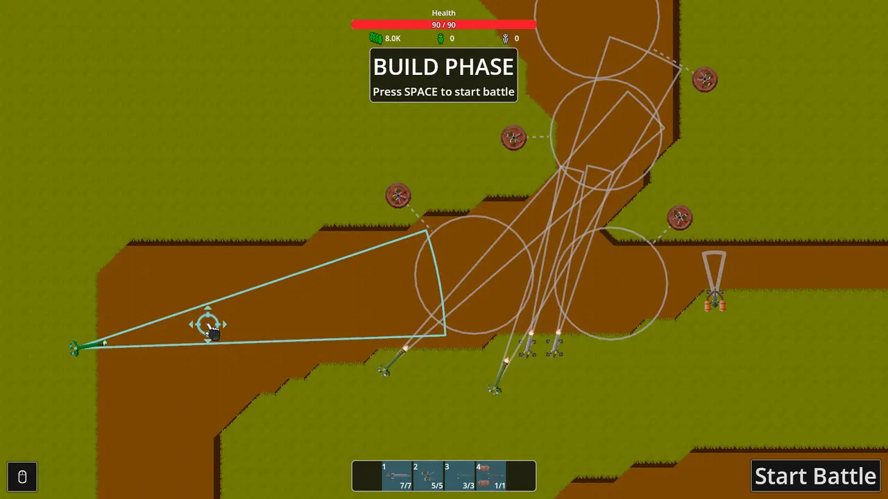
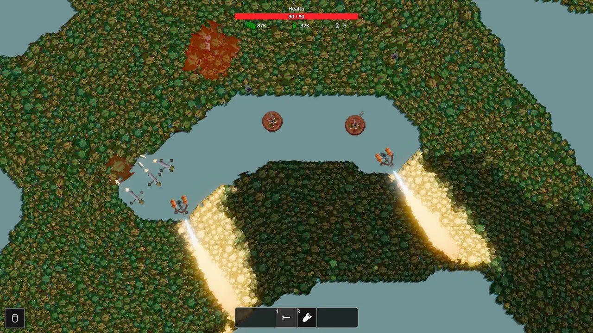
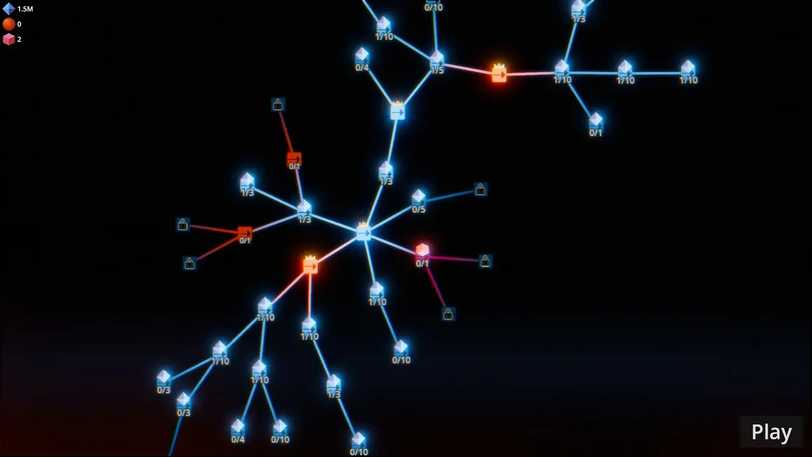

Steamで見かけた、画面を埋め尽くすほどのオークを火力で押し返すゲームが気になっている。

タイトルは『司令官、オークの大群です！』。2026年7月28日に発売されたばかりだが、Steamではすでに2,000件を超えるレビューが集まり、開発元から10万本突破も発表されている。

まだ実際には遊んでいないため、今回は感想ではなく、公式情報とSteamレビュー、海外コミュニティの反応をもとに「どんなゲームなのか」を整理する。

> ※本記事は2026年8月4日時点の情報をもとにしています。レビュー数や評価、ゲーム内容は今後変わる可能性があります。

## 『司令官、オークの大群です！』とは

『司令官、オークの大群です！』は、ドイツのMumpitz Gamesが開発・販売するインクリメンタル型タワーディフェンス。

基地へ押し寄せる数万体規模のオークに対してタワーを配置し、弾丸、爆弾、レーザーなどで迎撃する。勝敗にかかわらず資源を持ち帰り、タワーや能力を強化して再挑戦する周回型のゲームだ。

| 項目 | 内容 |
|---|---|
| 開発・販売 | Mumpitz Games |
| 発売日 | 2026年7月28日 |
| ジャンル | インクリメンタル型タワーディフェンス |
| プレイ人数 | シングルプレイ |
| 対応OS | Windows / SteamOS・Linux |
| 日本語 | インターフェースに対応 |
| Steam評価 | 2,045件中86％好評「非常に好評」 |

## 配置して、迎撃して、強化する

公式説明と公開されている映像から確認できる大まかな流れは、次のとおり。

1. アンロックしたタワーを配置し、射線や攻撃範囲を調整する
2. 戦闘を開始し、複数方向から押し寄せるオークを迎え撃つ
3. 機銃掃射、軌道レーザー、核爆弾などのアクティブ能力を使う
4. 勝敗にかかわらず、戦闘で得た資源を持ち帰る
5. アップグレードツリーでタワーや能力を強化し、再挑戦する

ラン中にランダムな強化を拾い集めるタイプというより、同じステージへ再挑戦しながら恒久強化を積み重ねる設計に近い。公式も「周回強化要素があるメタ進行システムを取り入れた短編タワーディフェンス」と説明している。

*戦闘前にタワーの配置と射線を調整する。画像出典：[Steamストア](https://store.steampowered.com/app/4594150/Sir_We_Have_an_Orc_Problem/?l=japanese)／© Mumpitz Games*

## とにかくオークの数が多い

本作で最も目を引くのは、地面が見えなくなるほど押し寄せるオークの大群だ。

個々のオークが物理挙動で押し合い、細い通路へ流れ込んでいく。そこへ砲撃や爆発を当てると、密集した大群がまとめて吹き飛ぶ。一般的なタワーディフェンスの整然とした列というより、緑色の濁流を火力でせき止めるような見た目になっている。

SteamレビューやRedditでも、この規模感と大量撃破の爽快感を評価する声が多い。タワーの攻撃方向を調整し、オークが密集する場所へ射線を重ねてキルゾーンを作る仕組みも好評だった。

*オークの数は画面上の表示で8万体を超えている。画像出典：[Steamストア](https://store.steampowered.com/app/4594150/Sir_We_Have_an_Orc_Problem/?l=japanese)／© Mumpitz Games*

## 大きなアップグレードツリーで恒久強化

戦闘で得た資源は、タワーのアンロックや恒久強化に使う。

アップグレードツリーには複数の分岐があり、威力、射程、連射速度などを伸ばしながら新しいタワーや能力へ進んでいく。負けたランでも資源を得られるため、「挑戦する→強化する→先へ進む」というインクリメンタルゲームらしい成長が止まりにくい。

一方、この恒久強化は本作の面白さであると同時に、コミュニティで意見が分かれている部分でもある。詳しくは後半で触れる。

*資源を使って新しいタワーや強化を順番に解放する。画像出典：[Steamストア](https://store.steampowered.com/app/4594150/Sir_We_Have_an_Orc_Problem/?l=japanese)／© Mumpitz Games*

## 公式リリーストレーラー

公式トレーラーでは、オークが通路を埋めていく様子や、爆撃、レーザーなどで一気に押し返す場面を確認できる。

  <iframe src="https://www.youtube-nocookie.com/embed/Han4JCx0qEw" title="Official Release Trailer - Sir, We Have an Orc Problem" loading="lazy" allow="accelerometer; autoplay; clipboard-write; encrypted-media; gyroscope; picture-in-picture; web-share" allowfullscreen style="position: absolute; inset: 0; width: 100%; height: 100%; border: 0;"></iframe>

動画：[Official Release Trailer - Sir, We Have an Orc Problem](https://www.youtube.com/watch?v=Han4JCx0qEw)／Mumpitz Games公式YouTubeチャンネル

## Steamでは「非常に好評」、発売直後に10万本突破

2026年8月4日時点のSteam評価は、**2,045件中86％が好評**で、総合評価は「非常に好評」。発売から約1週間の新作としては、かなり多くのレビューが集まっている。

開発元は8月1日、Steamニュースで販売本数が10万本を突破したことも発表した。シンプルな見た目ながら、大量の敵を表示する分かりやすいインパクトが注目につながっているようだ。

## コミュニティで好評な点

Steamの上位レビューやRedditでは、主に次の点が評価されている。

- 数万体のオークをまとめて吹き飛ばす爽快感
- オークが密集して流れる物理挙動の面白さ
- 配置、敗北、強化、再挑戦を繰り返す分かりやすいループ
- タワーの射線を重ね、効率の良いキルゾーンを作る楽しさ
- 短時間でも成長を実感しやすく、つい再挑戦したくなるテンポ

複雑なルールを覚えるよりも、強化によって火力が上がり、倒せる数が目に見えて増えていく気持ち良さが支持されている印象だ。

## 気になる点・不満として挙がること

好評率は高いものの、上位レビューでは次の不満も繰り返し挙がっている。

- 全体のボリュームが短く、マップ数も少なく感じる
- 次のステージへ進むため、クリア済みのステージを周回する場面がある
- 配置の工夫より、恒久強化による火力差が勝敗を決めると感じることがある
- 勝利がほぼ決まった後の待ち時間を短くする早送り機能が欲しい
- エンドレスモード、マップエディター、Steam Workshop対応が欲しい

数時間から10時間ほどで最後まで遊んだという報告も複数あり、長く遊び続ける作品というより、1〜2日で集中的に楽しむ短編として受け止めているプレイヤーが多い。

特に「大群を倒す見た目は面白いが、周回が単調になりやすい」という点は、購入前に知っておきたい部分だと思う。開発元は今後の計画をあらためて案内するとしているため、追加コンテンツや改善については続報を確認したい。

## どんな人に合いそうか

現時点の情報を見る限り、次のような人には合いそうだ。

- 画面を埋め尽くす敵をまとめて倒すゲームが好き
- タワーディフェンスと恒久強化の組み合わせにひかれる
- 複雑すぎず、短期間で遊び切れるゲームを探している
- 配置を少しずつ調整し、前回より効率良く倒すのが好き

反対に、多数のマップを長期間攻略したい人や、恒久強化よりも毎回の戦術だけで勝敗を決めたい人は、現状のボリュームや周回設計が合わない可能性がある。

## まとめ

『司令官、オークの大群です！』は、数万体のオークを大量の弾丸、爆弾、レーザーで迎え撃つ、短編のインクリメンタル型タワーディフェンスだ。

Steamでは「非常に好評」で、大群を吹き飛ばす爽快感と分かりやすい強化ループが支持されている。一方、短さや同じステージの周回、早送り・エンドレスモード・Workshopを求める声も目立つ。

長く遊び続ける大作としてではなく、圧倒的な物量を短時間で楽しむゲームとして考えると、特徴が分かりやすい。自分もまず遊んでみて、配置の工夫と恒久強化のバランスがどう感じられるかを確認したい。

## 参考情報

- [『司令官、オークの大群です！』公式Steamページ](https://store.steampowered.com/app/4594150/Sir_We_Have_an_Orc_Problem/?l=japanese)
- [Steamのユーザーレビュー](https://steamcommunity.com/app/4594150/reviews/?browsefilter=toprated)
- [100,000 sales（Steamニュース）](https://store.steampowered.com/news/app/4594150/view/699897618302502660)
- [Mumpitz Games公式YouTubeチャンネル](https://www.youtube.com/@MumpitzGames)
- [Reddit：r/TowerDefenseでの反応](https://www.reddit.com/r/TowerDefense/comments/1v8yhkb/sir_we_have_an_orc_problem_is_addicting/)
