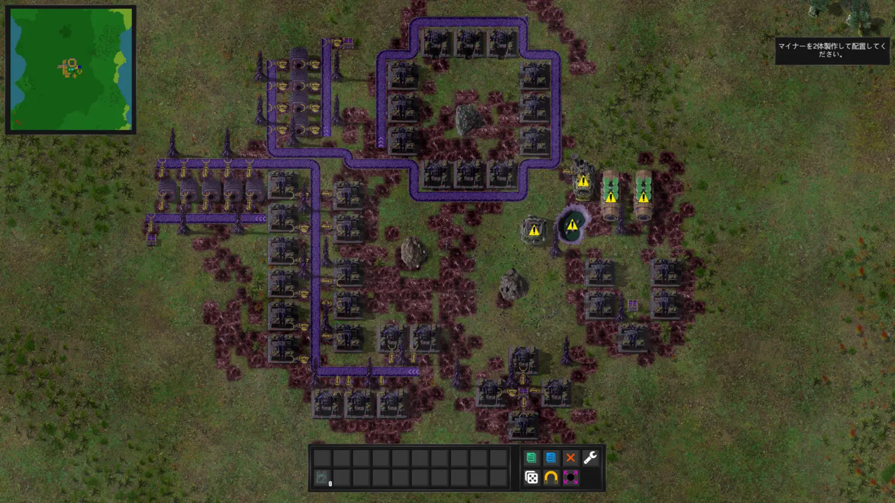
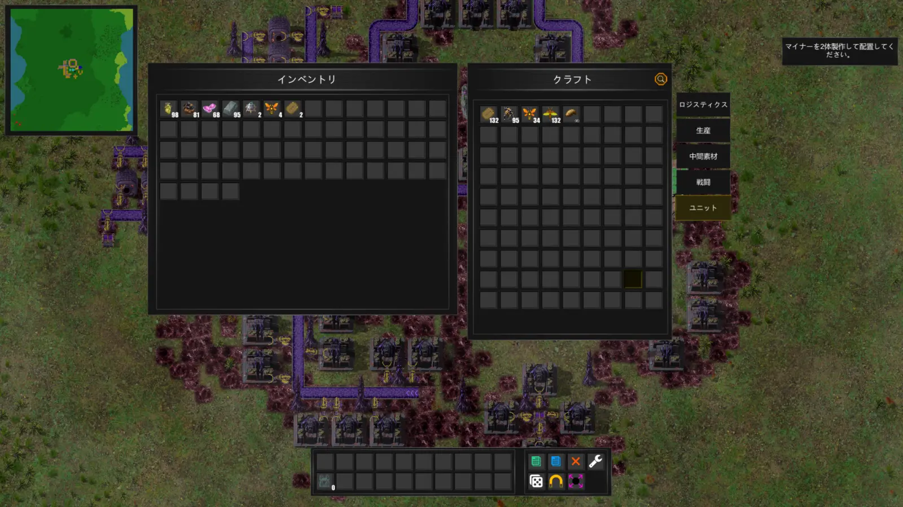
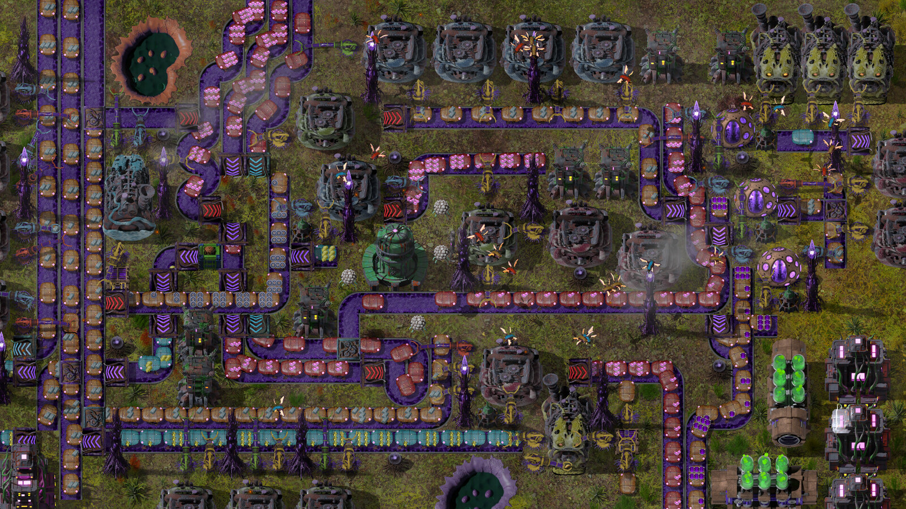
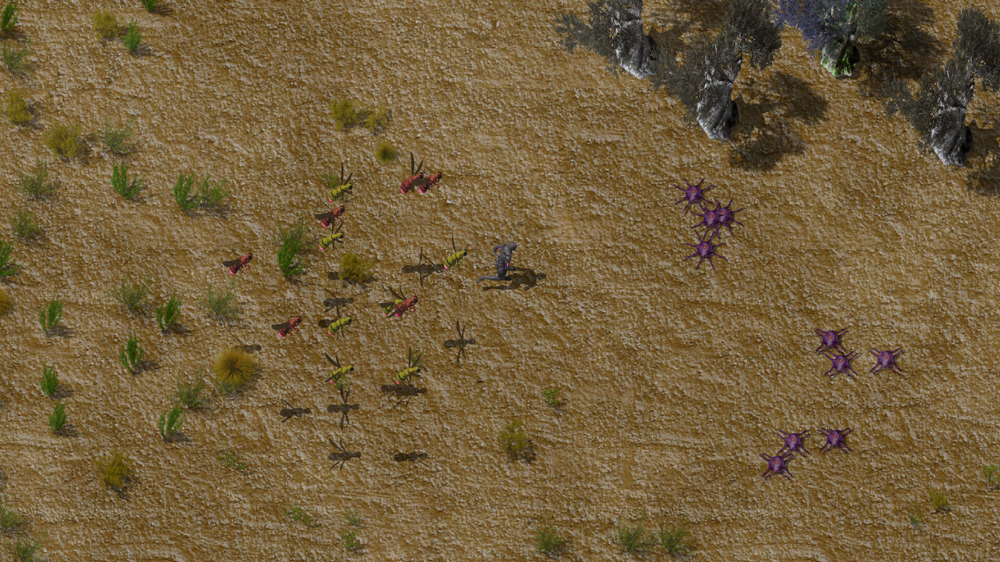
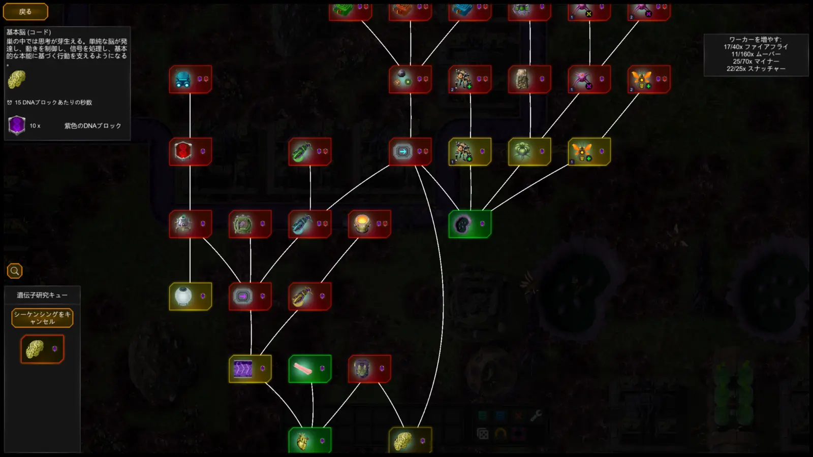
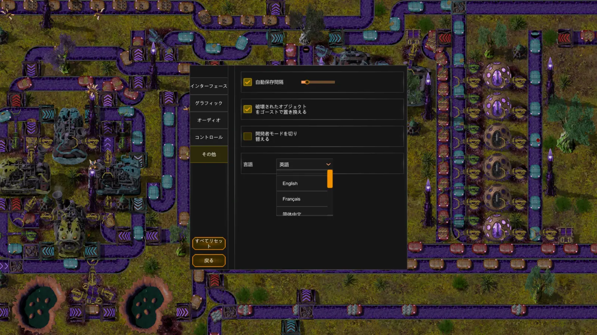

## はじめに

Steamで見つけた工場建設ゲーム『Swarmdustry』の体験版を遊んでみた。

今回は、体験版のチュートリアルを1時間程度プレイした時点での感想となる。

資源を集めて生産ラインを作り、研究を進めながら工場を拡張していく流れは『Factorio』にかなり近い。

ただし、本作で物流や電力を動かしているのは、ベルトコンベアや電線ではなく虫の群れ。

自分が虫側となって工場を作り、敵としてロボットが襲ってくるという「逆Factorio」のような設定も特徴になっている。

まだ体験版の序盤を触った段階なので、今回は「どんなゲームだったか」「最初に気になった部分」を備忘録として残しておく。

> ※本記事は2026年8月時点の体験版をもとにしています。開発中のため、正式版では内容が変更される可能性があります。

## 『Swarmdustry』とは

『Swarmdustry』は、Mitchy Studiosが開発する工場建設・自動化ストラテジー。

プレイヤーは虫の群れを成長させながら、資源の採掘・運搬・加工を自動化していく。

- 開発・販売：Mitchy Studios
- ジャンル：工場建設・自動化・ストラテジー
- プレイ人数：シングルプレイ
- 対応プラットフォーム：PC（Steam）
- 日本語：対応
- 早期アクセス開始予定：2026年8月20日
- 体験版：無料配信中

体験版では、チュートリアル、序盤の遺伝子コード、資源採取・物流・自動化といった基本システムを体験できる。

公式のプレイ時間目安は約4～8時間。技術ツリーなどは体験版用に制限されており、セーブデータは早期アクセス版へ引き継がれない。

## 基本的なゲームの流れ

序盤はプレイヤー自身で木材や鉱石を集めるところから始まる。

そこから設備と虫を増やし、少しずつ手作業を自動化していく。

1. 手作業で資源を集める
2. 採掘や運搬を担当する虫を生み出す
3. 資源を運ぶための経路を作る
4. 加工設備へ資源と電力を届ける
5. 遺伝子コードを研究して新しい設備を解放する
6. 工場を拡張する
7. 敵の襲撃に備える

設備を設置するだけでは工場は動かず、採掘・運搬・電力供給などを担当する虫も用意する必要がある。

*チュートリアルで用意された工場。まずは不足している虫や設備を補い、物流を動かしていく。*

インベントリとクラフト画面では、集めた素材の確認と、設備や虫の作成を行う。一般的な工場ゲームに近い構成なので、基本操作そのものにはなじみやすかった。

## 一番の違いは、物流と電力を虫が担当すること

『Factorio』との一番大きな違いは、物流と電力供給を虫が担当していることだと思う。

単に機械の見た目を虫へ置き換えただけでなく、それぞれの仕事を担当する虫を生産して配置する必要がある。

### コンベアではなく、虫が資源を運ぶ

本作には、一般的なベルトコンベアに相当するSwarm Trailという経路がある。

ただし、経路そのものが資源を動かすわけではない。その上をMoverと呼ばれる虫が移動し、実際に資源を運搬する。

そのため、経路を設置してもMoverが足りなければ物流は止まる。運搬量を増やすには、経路だけでなく働く虫の数も増やす必要がある。

この仕組みによって工場内を虫が動き回るようになり、「生きた工場」らしさが出ている。

一方、今回一番困ったのも、このコンベアに相当する物流部分だった。

一般的な工場ゲームのベルトコンベアと同じ感覚で設置すると、思ったように資源が流れない。

Moverの配置や経路、設備の入出力を確認しながら、どこで止まっているのかを探す必要があった。

仕組みを理解するまでは少し分かりにくいが、物流がつながって正常に動き始めたときの達成感はある。

### 電力も虫が届ける

電力供給にも虫が使われている。

Spireと呼ばれる中継地点を設置し、Fireflyという虫がその間を飛びながら設備へエネルギーを届ける。

一般的な工場ゲームでは、発電設備と電柱をつなげば周囲の設備へ自動的に電力が供給される。

一方の『Swarmdustry』では、Fireflyが実際に移動して電力を届けるため、発電量だけでなく、

- Fireflyの数
- Spireの配置
- 設備までの距離
- 工場全体の電力需要

なども考える必要がある。

物流と同じように、電力まで虫が物理的に運んでいるのは本作らしい部分。

現時点では『Factorio』に近い要素が多いものの、物流と電力を虫の数や動きで管理する仕組みは、最も独自性を感じたところだった。

## 虫が増えることで発展を実感できる

工場が大きくなるにつれて、採掘や運搬を担当する虫の数も増えていく。

設備が増えるだけでなく、画面内を動き回る虫が目に見えて増えるため、工場が発展してきた実感を得やすい。

運搬役の虫が列になって資源を運び、それぞれの場所で別の虫が働いている様子は、画面的にも賑やか。

生産量の数字だけでなく、群れそのものが大きくなっていくことで発展を表現しているのは良かった。

*公式スクリーンショット。約1時間のチュートリアル時点では未到達の規模を含む。画像出典：[Swarmdustry Steamストア](https://store.steampowered.com/app/4000770/Swarmdustry/)／Mitchy Studios*

### 虫は思ったより気持ち悪くない

虫が大量に登場するゲームなので、見た目の気持ち悪さが気になる人もいると思う。

実際に遊んでみると、今のところそこまで虫の気持ち悪さは感じていない。

リアルな虫を大きく映すような見せ方ではなく、工場内で働く小さなユニットとして動いているため、思っていたより気にならなかった。

むしろ、それぞれの虫が仕事を持って動き回る様子は、工場を賑やかに見せる要素になっている。

### 動きは賑やかだが、画面全体は暗め

虫が増えることで画面の動きは賑やかになる一方、色味は全体的に暗い。

虫や有機的な工場をテーマにしているため仕方のない部分ではあるが、茶色や暗い色が多く、工場が発展しても見た目の華やかさは少し物足りなく感じた。

体験版の序盤では、規模が大きくなっても画面全体の印象はあまり変わらなそうにも見える。

研究や工場の発展に合わせて、虫や設備の色、光り方、周囲の景色などにも変化が出ると、さらに発展を実感しやすくなりそう。

「動きとしては賑やかだが、色味としては暗い」というのが、今のところの印象に近い。

## 工場の拡大が敵の襲撃につながる

工場を拡大すると、建物から放出された胞子によってCreepと呼ばれる領域が周囲へ広がっていく。

このCreepの拡大を察知すると、惑星に存在するロボット勢力が群れを排除するために攻撃してくる。

効率だけを優先して工場を広げると防衛が追いつかなくなるため、生産と防衛のバランスも必要になる。

正式版では、自動修理を行うDrone、攻撃用のBloodfly、追加の防衛タワーなども用意されると開発者が説明している。

*公式スクリーンショット。戦闘は約1時間のプレイでは未確認。画像出典：[Swarmdustry Steamストア](https://store.steampowered.com/app/4000770/Swarmdustry/)／Mitchy Studios*

## かなり強く『Factorio』を意識している

ゲームを始めてすぐに感じたのは、想像していた以上に『Factorio』に近いこと。

主な要素を比較すると以下のようになる。

| Factorioで近い要素 | Swarmdustry |
|---|---|
| ベルトコンベア | Swarm TrailとMover |
| 採掘機 | 採掘を担当する虫 |
| 電柱・送電網 | SpireとFirefly |
| 研究ツリー | 遺伝子コード |
| 建設ロボット | Drone |
| 汚染による敵の襲撃 | Creepの拡大によるロボットの襲撃 |

資源を採掘して加工し、研究を進めながら工場を拡張していく基本的な流れだけでなく、工場が大きくなるにつれて敵の襲撃への対応が必要になるところまでよく似ている。

開発者自身も『Factorio』から強い影響を受けていることを認めている。

一方で、機械を並べるだけではなく、物流・採掘・電力供給などを担当する虫の群れ自体を管理するゲームを目指していると説明している。

研究画面も『Factorio』に近いツリー形式。DNAブロックを使って遺伝子コードを解放し、設備や虫の種類を増やしていく。

### 自分が虫側で、敵がロボット

『Factorio』ではプレイヤーが工場を作り、原生生物である虫と戦う。

一方の『Swarmdustry』では、プレイヤー自身が虫の群れを率いて工場を作り、敵としてロボットが襲ってくる。

立場がほぼ逆になっているため、「虫側から遊ぶ逆Factorio」という構図は、かなり意識して狙っているように感じた（笑）。

この設定自体は分かりやすく、虫が工業技術を取り入れて発展していく世界観も面白い。

ただ、物流と電力以外は『Factorio』に近い部分が多く、全体としては『Factorio』の大型MODを遊んでいるような感覚にも近かった。

## 面白くなりそうだが「Factorioでよいのでは」も残る

『Factorio』に近いということは、工場を拡張して自動化していくゲームとして面白くなる可能性は高そう。

生産量が増え、扱う資源や設備が増えていけば、複雑なラインを考える楽しさも出てくると思う。

一方で、基本部分がかなり近いため、今のところは「それならFactorioを遊べばよいのでは」とも思ってしまう。

MoverやFireflyなど、物流と電力を虫で動かす仕組みには独自性がある。

ただ、約1時間のチュートリアル時点では、それが『Factorio』とは別の面白さとしてどこまで広がるのかは確認できていない。

今後、

- 虫の種類や組み合わせ
- 群れならではの大量運用
- 虫の進化や変異
- 有機的な工場の変化
- ロボット勢力との戦い方

といった部分が増えれば、本作ならではの魅力がさらに出てきそう。

工場ゲームとして面白くなりそうな安心感はあるので、早期アクセス版でどこまで独自性が広がるのかに期待したい。

## チュートリアルは少し分かりにくい

約1時間、チュートリアルを進めた。

特に物流では、コンベアに相当する経路を作っても思ったように資源が動かず、Moverや入出力の設定を確認しながら進める必要があった。

少し分かりにくい部分はあったものの、ゲームの進行が止まるほどではなく、ひとまず問題なく進められた。

工場建設ゲームは、動かない原因を探し、配置や生産量を調整していくこと自体が楽しみの一つだと思う。

すべてを細かく説明してほしいというより、試行錯誤するために必要な情報が、もう少し見つけやすくなると良さそう。

## 日本語は遊べるが、言語表示が少し不思議

日本語翻訳は基本的には問題なく、ゲームの進行に困るほどではなかった。

設備やアイテムの説明も、おおまかな意味は理解できる。一方で、一部に英語の原文が残っていたり、意味は分かるものの少し不自然な日本語になっていたりする箇所もある。

特に不思議だったのが言語設定。設定欄で漢字の「英語」と表示されている項目を選ぶと、画面全体は日本語になった。

自動翻訳が原因かどうかは確認できていない。ただ、画面のほとんどは日本語へ切り替わっているため、翻訳方式よりも、現在の言語名だけが誤って表示されるUI・ローカライズ上の不具合に見える。

完全に翻訳が整っている状態ではないが、体験版を遊ぶうえでは大きな問題にはならなかった。早期アクセス開始までに、さらに調整されることを期待したい。

## 海外コミュニティの反応

2026年8月3日時点で、Steam体験版の評価は「やや好評」。レビューは33件で、そのうち72％が好評となっている。

まだレビュー数は少ないが、海外でも虫を使った工場というコンセプトや、虫のアニメーションを評価する声が見られる。仕組みを理解して工場を拡張し始めると、夢中になって遊べたという感想もあった。

一方で、気になる点としては、

- チュートリアルが途中から分かりにくくなる
- 物流の入出力やMoverの挙動を理解しにくい
- Fireflyによる電力供給の状態を把握しにくい
- 『Factorio』との違いがまだ弱い
- 虫を使う仕組みが手間の追加に感じる

といった意見が出ている。

特に物流と電力の分かりにくさは、今回自分が遊んで感じた部分とも近かった。

『Factorio』との近さについても、「見た目違いに感じる」という意見がある一方、「Factorioの虫側を遊ぶ設定として面白い」と肯定的に受け止める意見もある。

開発者はコミュニティでの指摘に回答し、チュートリアルへ説明を追加するなど、体験版を更新している。

早期アクセス作品として、プレイヤーの反応を見ながら改善している点は期待できそう。

## 今後追加予定の内容

早期アクセス版では、体験版より広い技術ツリーやマップ生成、建設自動化、追加の防衛設備などが利用できる予定。

さらに正式リリースへ向けて、

- ビジュアルとバランスの改善
- メガベース建設要素の拡張
- 車両
- 液体
- コントローラー・Steam Deck対応
- 実績
- 対応言語の追加

などが計画されている。

今のところ感じている画面の暗さや、『Factorio』との独自性についても、今後の追加要素や調整で印象が変わる可能性はありそう。

## まとめ

今回は『Swarmdustry』体験版のチュートリアルを1時間程度遊んだ。

一番の違いは、物流と電力を虫が担当していることだと思う。

運搬役のMoverや電力を届けるFireflyを増やし、それぞれが実際に工場内を動く。虫の数が増えるほど画面も賑やかになり、工場が発展してきたことを見た目でも実感できるのは良かった。

虫の見た目も、今のところ想像していたほど気持ち悪くない。

一方で、画面全体の色味は暗く、発展しても見た目の華やかさは少し物足りなく感じた。

ゲームシステムは『Factorio』の影響がかなり強く、体験版の範囲では大型MODを遊んでいるような感覚にも近い。

自分が虫側となり、ロボットを相手に工場を広げていく「逆Factorio」という設定は面白い。ただ、現時点では「Factorioでよいのでは」と感じる部分も残っている。

チュートリアルや物流には少し分かりにくさがあるものの、試行錯誤しながら工場を動かすことも、このジャンルの楽しみの一つ。ひとまず大きく詰まることなく進められた。

まだ約1時間のチュートリアル時点なので、研究や虫の種類が増えた後の遊びまでは確認できていない。

工場建設ゲームとして面白くなりそうなのは確かなので、今後は虫の進化や群れの管理など、本作ならではの仕組みがどこまで広がるのかに期待したい。

## 参考リンク

- [Swarmdustry Steamストアページ](https://store.steampowered.com/app/4000770/Swarmdustry/)
- [Swarmdustry Demo](https://store.steampowered.com/app/4461840/Swarmdustry_Demo/)
- [Factorioとの違いに関する開発者の説明](https://steamcommunity.com/app/4000770/discussions/0/595161023680382579/)
- [Steamコミュニティの初見感想](https://steamcommunity.com/app/4000770/discussions/0/801219096906893512/)
- [チュートリアルに関する意見と開発者の回答](https://steamcommunity.com/app/4000770/discussions/0/571541539431434711/)
- [MoverとFireflyに関する意見](https://steamcommunity.com/app/4000770/discussions/0/562534659773285370/)
- [防衛要素に関する開発者の回答](https://steamcommunity.com/app/4000770/discussions/0/571541539431676574/)
